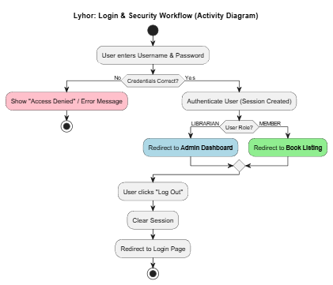
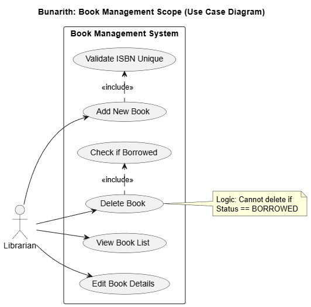
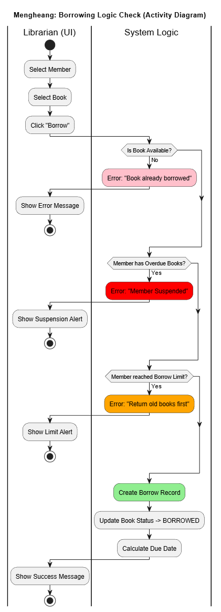
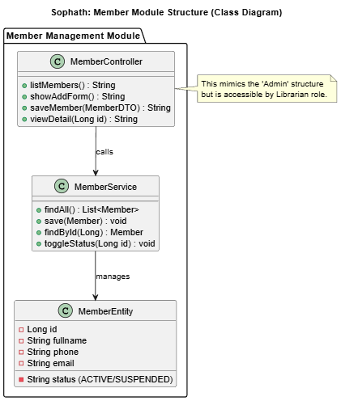
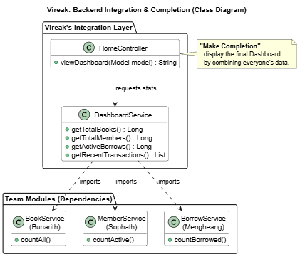

# 📚 Project 4: Library Borrowing & Tracking Systems

## 🔐 Lyhor (Security & Auth Lead)
*Responsible for Login, Roles, and Access Safety.*

- [ ] **Log in page** (Custom design, not default Spring)
- [ ] **Access denied page** (Error 403 UI)
- [ ] **Log out function** (Clear session)
- [ ] **Flow testing** (Verify Librarian vs. User permissions)

**📝 Logic:**
> - If wrong username or password -> Show "Access Denied" or Error Message.
> - If successful -> Redirect to Homepage.

---

## 📚 Bunarith (Main Entity - Books)
*Responsible for the Book Inventory and Home Display.*

- [ ] **Homepage** (Dashboard or Landing page)
- [ ] **Book listing** (Table view of all books)
- [ ] **Add/Edit book** (CRUD Forms)
- [ ] **Book detail** (View single book info)

---

## 🔄 Mengheang (Borrowing Logic & UI)
*Responsible for the Core Library Workflow.*

- [ ] **Borrowing book UI** (Form to select Member & Book)
- [ ] **Return/Overdue book UI** (List of active borrows)

**📝 Logic:**
> - **Check Return:** If member wants to borrow, Librarian checks if they returned previous books.
>   - *If No* -> Cannot borrow anymore.
> - **Check Overdue:** If member has an overdue book.
>   - *Result* -> Member suspended from borrowing more.

---

## 👥 Sophath (Secondary Entity - Members)
*Responsible for Member Management.*

- [ ] **Member list** (View all registered members)
- [ ] **Member add/edit form** (Register new members)
- [ ] **Member detail view** (See specific member info)

**📝 Logic:**
> - **Role View:** Logic is similar to an Admin page, but accessible by the Librarian to manage members.

---

## 🛠 Vireak (Backend & Database Lead)
*Responsible for Structure and Completion.*

- [✅] **Setup Project** (progress 1)
- [✅] **Backend Setup** (Spring Boot init,Dependencies) (progess 1)
- [✅] **Add Diagram for each member** (progress 2) 
- [ ] **Database** (ERD, Entity Relationships, Connection)
- [ ] **Make Completion** (Final integration, Dashboard stats, Polish)

---

## ✅ Team Checklist
- [✅] Github Repository Created (progess 1)
- [✅] Database Connected (progress 1)
- [ ] Security Login Working
- [ ] All CRUDs Working
- [ ] Borrowing Logic Tested