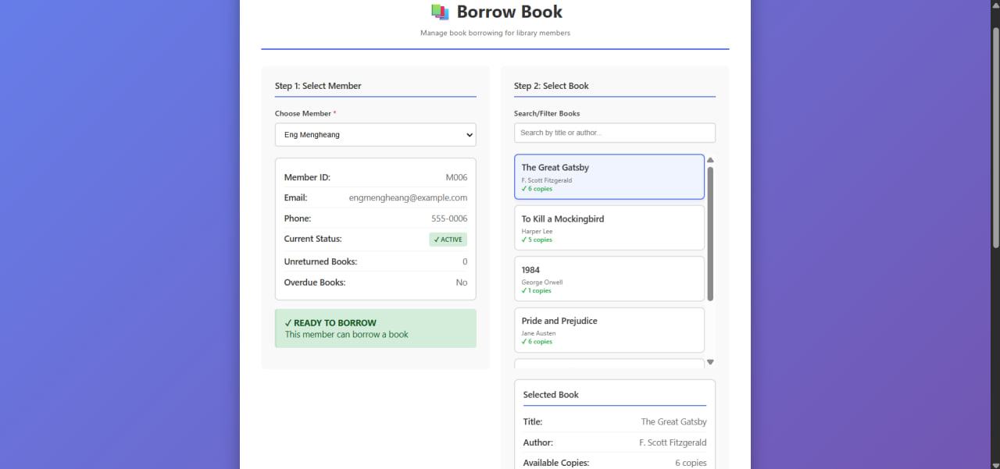
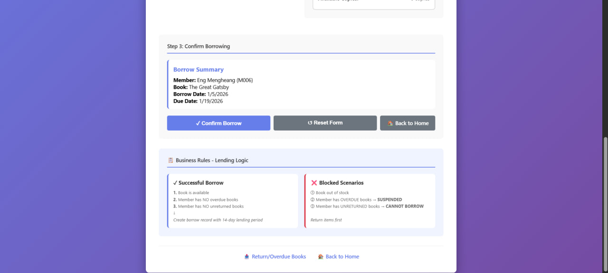
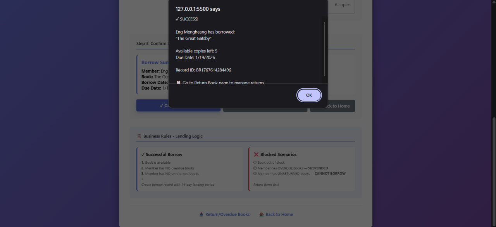
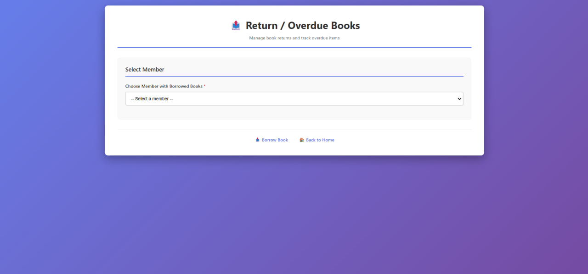
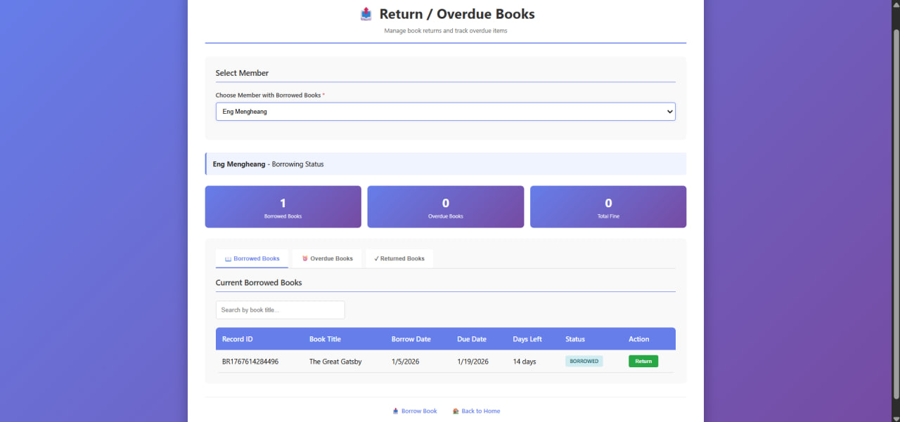

## 1. Work Done

I have finished the main functions for the library system: Borrow Book and Return Book.

### Borrow Book Page:

- Select member and book
- Show member info and book info
- Check if member can borrow (no overdue or unreturned books)
- Show due date
- Save borrow record in localStorage
- Show messages for success or errors

### Return/Overdue Page:
- Select member to see borrowed books
- Show borrowed and overdue books in a table
- Show total borrowed and overdue books
- Return books with a button
- Show message if no borrowed books

## 2. Status
- Borrow function: ✅ Done
- Return function: ✅ Done
- Data storage using localStorage: ✅ Done
- UI design: ✅ Done