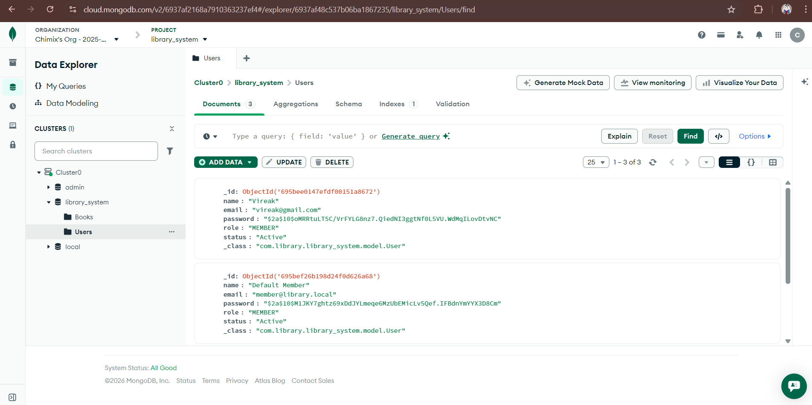
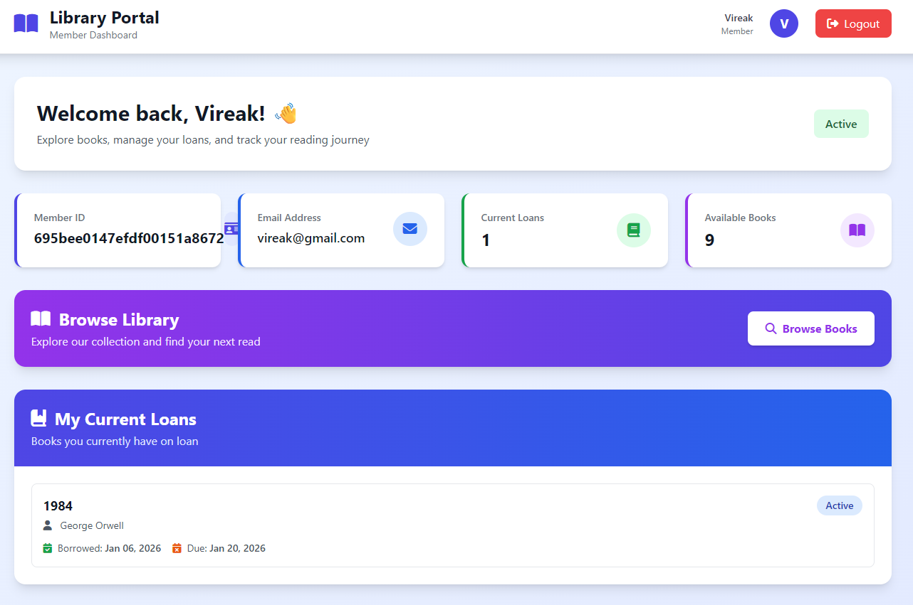
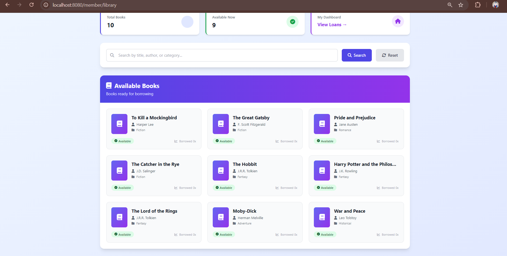
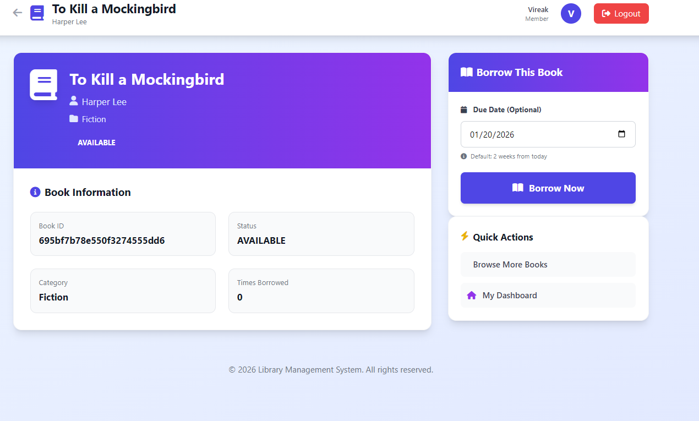
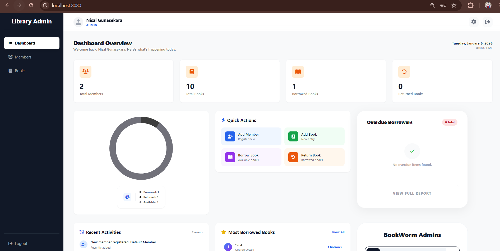
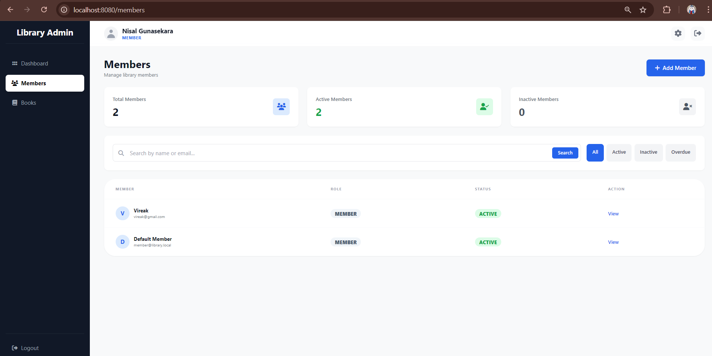
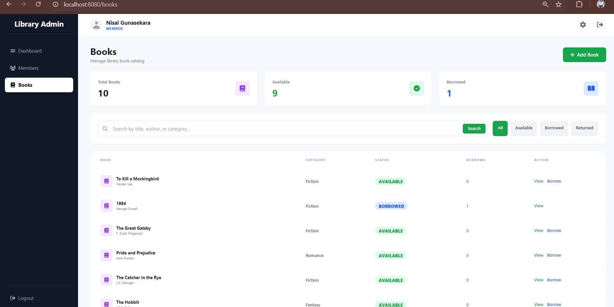

# Progress Update — Vireak

## Summary
This update summarizes recent integration and feature work for the Library Management project. The main focus was merging team contributions and connecting frontend pages to backend services (login, signup, book data, borrowing flow, and admin views).

## Completed Tasks
- **Repository merge:** Merged code from all team members and resolved merge conflicts to create a unified codebase.
- **Authentication:** Implemented and connected backend endpoints for user `login` and `signup`. Frontend forms now communicate with the backend API and handle success/error responses.
- **Homepage routing:** After a successful login, users are redirected to their homepage/dashboard.
- **Book data:** Book records are stored in the database and are displayed on the library tab/frontpage. The frontend list is populated from the backend API.
- **Borrow flow:** The borrow action is fully functional — users can borrow books from the UI and the request is persisted in the database.
- **Admin synchronization:** Admin dashboard is connected to the backend. When a user borrows a book, the admin view updates accordingly.
- **User management:** Admins can view the list of registered users from the admin interface.
- **Admin book view:** Admins can view and manage book data from the admin panel.

## Implementation Details
- **Authentication flow:** Frontend sends credentials to backend `POST /auth/login` and `POST /auth/signup`. On successful login, a session or token is created and the user is redirected to the dashboard.
- **Data flow:** Book and borrow data are fetched via REST endpoints. The UI uses these endpoints to render lists and handle interactions (borrow/return).
- **Admin updates:** Borrow and return actions trigger backend updates that are reflected in the admin UI, ensuring both user and admin views remain consistent.

## Screenshots
The following images illustrate the main features and flows (refer to the local attachments in the repo):

- Login / Signup connected to backend: 
- User redirected to homepage after login: 
- Book data displayed on library frontpage: 
- Borrow function in action: 
- Admin view updates when a user borrows a book: 
- Admin user list (registered users): 
- Admin book data view: 